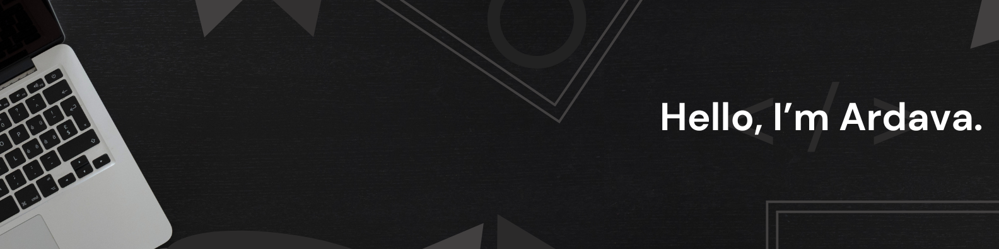

<div align="center">
  


## `Let's Connect and have a Chat! 💬`

<p align="center">
  <a href="https://linkedin.com/in/muhammad-karov-ardava-barus-27b000223">
    
  </a>
  &nbsp;&nbsp;&nbsp;
  <a href="https://www.instagram.com/rdavaa_/">
    
  </a>
</p>

</div>

---

## 👨‍💻 A Little Bit About Me and My Interests

```json
{
  "name": "Muhammad Karov Ardava Barus",
  "location": "Bandung, West Java",
  "education": [
    "Telkom University - B.S. in Data Science (Expected 2027)",
    "SMA Harapan 3 Deli Tua - Science Major"
  ],
  "fields_of_interest": [
    "Data Science & Analytics",
    "Machine Learning & AI",
    "Generative AI & LLMs",
    "Cloud & DevOps",
    "Full-Stack Development"
  ],
  "technical_background": [
    "Machine Learning Engineer",
    "Lead Data Scientist"
  ],
  "currently_learning": [
    "Advanced DevOps & Cloud Architecture",
    "Large Language Models"
  ]
}
```


---

## 💻 Tech Stack:

               

---

## 📊 GitHub Statistics:

<div align="center">

 

<br/>


</div>
